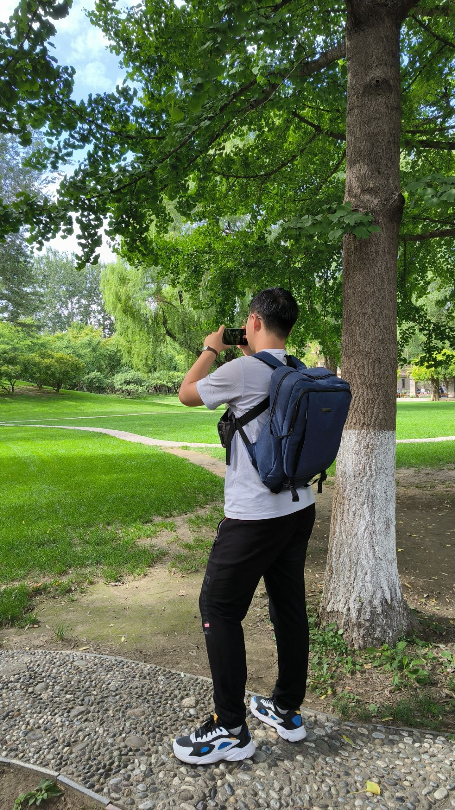
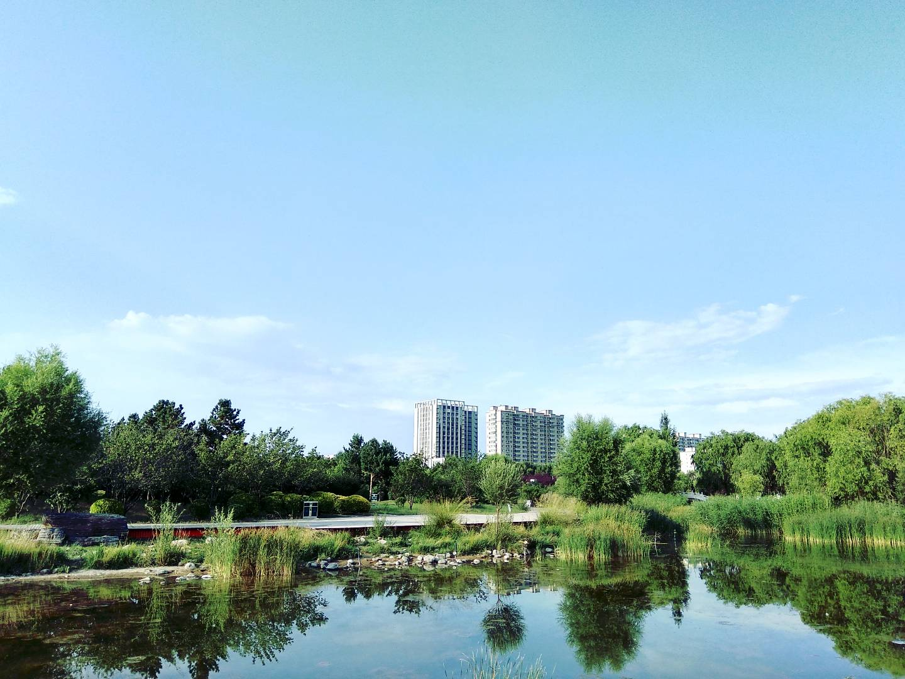

## 关于作者

你好，我是蛋卷儿！目前就读于北京邮电大学计算机学院，数据科学与大数据技术专业。

我热爱学习我感兴趣的新知识，最近我在学习 Linux 系统、Typst、JavaScript 等技术。

虽然学起东西来常常是半吊子，但是只要能保持充足的兴趣，知识总会慢慢增长起来的吧（心虚）。

### 作者的技能

- 擅长 Au、Ps、Pr 等专业软件软件的安装与卸载；
- 精通 CSS、JavaScript、C、Java、Python、Rust 等单词的拼写；
- 熟悉 Windows、Linux、Android 等系统的开关机……

以上虽然是开玩笑，但是说的其实都是事实……

正经地说，我目前没有特别擅长的编程语言，但是从方向上来看，未来可能会比较擅长的语言可能是 JavaScript 以及与其相似的语言。

### “我”

文字的介绍似乎总是显得有些枯燥，我会在这里放上一些我的摄影作品，或是别人拍摄我自己的照片。

## 关于网站

关于网站的风格与目标，详情见[本博客的目标](https://eggroll.pages.dev/p/本博客的目标/)。

我的个人网站完全出于学习相关技术的目的，在网站可能会包含指向其他站点的内容或是来自其他网站的素材。在我的网页中可能会涉及到其他网页的图片、视频、音频等资源，这些资源的版权归属于原作者，我只是在网页中引用了这些资源，并未对其进行任何复制、修改、出版、发行等，也没有将这些资源使用到任何商业用途。

除非特别声明，本站所有内容版权均归原作者所有，任何媒体、网站或个人未经本站许可，不得转载、链接或以其他方式复制发表。本人承诺不会使用原作者已注明禁止转载的任何素材。

本网页 Logo 为本人自行绘制，著作权归本人所有，未经本人许可，不得使用。

如果您不希望您的作品出现在我的网页上，请通过 <JyEggRoll@outlook.com> 与我取得联系，我会在第一时间删除对您作品的引用。
