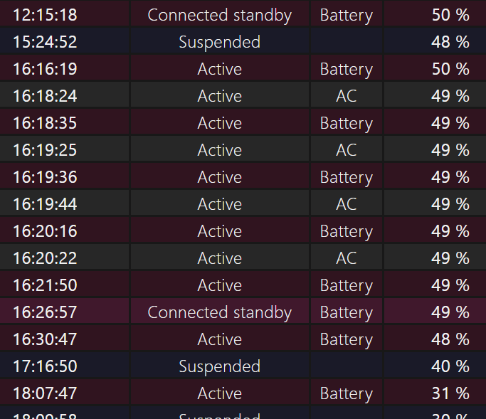
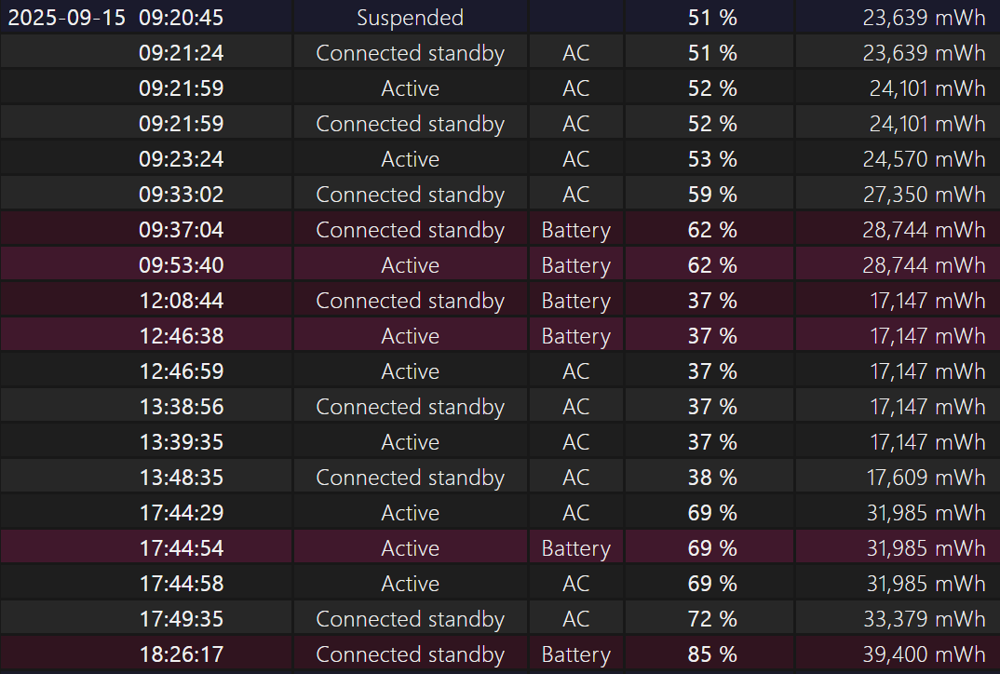

我最近注意到，给三星 GalaxyBook2 充电时，如果使用上方的 Type-C 口，有概率遇到充电功率大幅下降的情况。表现为电池显示“充电中”，但是电量几乎不会增长，还会随着使用降下来，这很令我困扰。

我这里截取部分电池报告：

我 15:24 回到宿舍，为平板接上电源，并开始使用。直到 16:16，我准备拔下电源带着平板去上课时，我才发现电量仅仅充入了 2%。该情况在前几天（2025-09-15）出现过一次，当时的电量报告为：

可以看到，从早晨 12:46 接入电源，到 17 点多，电量仅仅从 37% 达到了 69%，这个充电速度十分异常。但是，既然电量有所升高，就证明了“充电”这个过程是在正常进行的，但是功率非常非常低。

我开始探究这个问题。

搜索类似的情况，无果。

更换到下面的充电口，充电的速度马上就正常了。

关机，插入上方充电口，10 分钟内记录电量，增长明显，证明功率正常。

重启电脑，并更换到上方的充电口：充电速度也正常。

拔掉上方 C 口充电头，再插上，充电速度异常慢，甚至出现了电量下降的情况。

插入下方 C 口，充电速度恢复正常。

拔掉下方 C 口充电头，插入上方 C 口，充电速度仍然异常缓慢，未见缓解。

从目前的实验记录来看，总结如下：

充电速度下降这一问题从 09-15 出现，但是经过回溯调查，没有做对系统或者硬件做任何更改。经测试，在关机时，或者系统启动后，插入上方充电口，功率正常。一旦拔下再插入，功率将大幅下降。插入下方充电口，功率始终正常。

暂且为发现或查明任何原因，暂留做记录。
