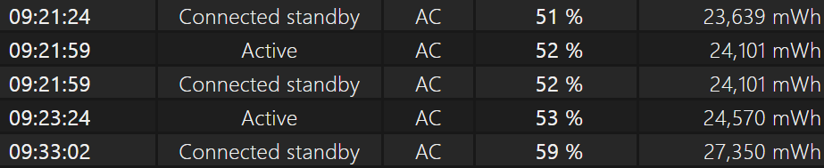

## 背景说明

我最近注意到，给三星 GalaxyBook2 充电时，如果使用上方的 Type-C 口，有概率遇到充电功率大幅下降的情况。表现为电池显示“充电中”，但是电量几乎不会增长，还会随着使用降下来，这很令我困扰。

我这里截取部分电池报告：

我 15:24 回到宿舍，为平板接上电源，并开始使用。直到 16:16，我准备拔下电源带着平板去上课时，我才发现电量仅仅充入了 2%。该情况在前几天（2025-09-15）出现过一次，当时的电量报告为：

可以看到，从中午 12:46 接入电源，到 17 点多，电量仅仅从 37% 达到了 69%，这个充电速度十分异常。但是，既然电量有所升高，就证明了“充电”这个过程是在正常进行的，但是功率非常非常低。

我开始探究这个问题。

搜索类似的情况，无果。

更换到下面的充电口，充电的速度马上就正常了。

关机，插入上方充电口，10 分钟内记录电量，增长明显，证明功率正常。

重启电脑，并更换到上方的充电口：充电速度也正常。

拔掉上方 C 口充电头，再插上，充电速度异常慢，甚至出现了电量下降的情况。

插入下方 C 口，充电速度恢复正常。

拔掉下方 C 口充电头，插入上方 C 口，充电速度仍然异常缓慢，未见缓解。

从目前的实验记录来看，总结如下：

充电速度下降这一问题从 09-15 出现，但是经过回溯调查，没有做对系统或者硬件做任何更改。经测试，在关机时，或者系统启动后，插入上方充电口，功率正常。一旦拔下再插入，功率将大幅下降。插入下方充电口，功率始终正常。

在上方 C 口外接拓展坞，为外部设备供电，不仅未见到功率异常，功率表现还非常不错。

在使用最高输出功率为 45 W 的三星官方充电器时的一些计算结果：

当功率比较正常时

以上功率为 27 W。

以上功率为 18.5 W。

当功率异常时

以上功率仅有 3 W。

百思不得其解，暂且未发现或查明任何原因，暂留做记录。

经此事件，我决定开发一个统计电脑充电及放电功率的软件[功率统计工具](https://eggroll.pages.dev/p/功率统计工具/)。

## 最终的解决方案

当我将系统降级到 23H2 后，经过两天的充电测试，问题已经消失。

可以合理推断：Windows 11 24H2 最近的某次更新损坏了电池驱动。

鉴于本设备距离发布有一定的时间了，可能已经不适合在追求“最新”的系统。此后，我将长期在此设备上使用 23H2。

## 近况更新 2025-11-08

在 23H2 上，竟然也复现了这个问题，这令我百思不其解，最起码不能完全归咎于 24H2 了。

触发方式不明。为了解决这个问题，我曾经单独开发了一个充电功率检测的软件，现在调试起来会方便不少。

在今天，开机后正常充电，突然降至功率极低的状态，净功率为 2 W 左右。重启后便立即解决，基本可以排除硬件问题。

这一版 23H2，我禁绝了所有的系统更新，而且这也是第一次出现问题。

有待后续继续调试观察。

测试记录：

- 使用上方的充电口，开机之后的第一次，总是正常的。
- 使用上方的充电口，正常后的第二次，有概率仍正常，有概率功率降低到几乎无法充电。
- 使用下方的充电口，总是正常的。

既然可以稳定地触发“正常”的情况，理论上硬件就没有损坏。现在，只能把原因放在电池驱动这一层面了。
