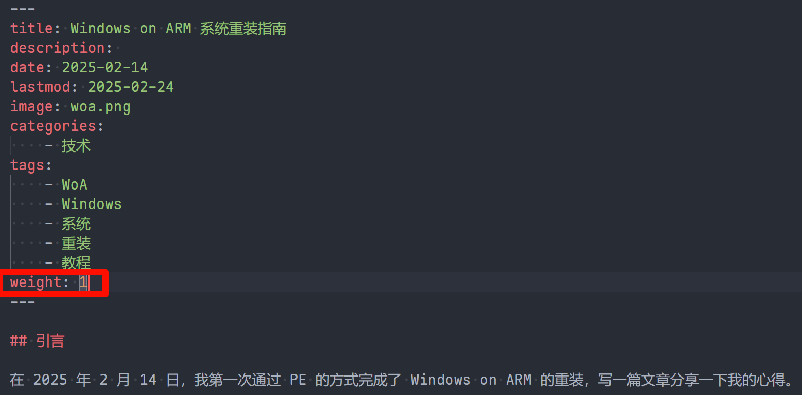

方法非常简单，在 md 元数据中加入 `weight` 即可。

It is easy to do, just add `weight` in the metadata of the markdown file.

例如：

For example:

经测试，权重越小，在展示上就越靠前。似乎有封面图文章和无封面图文章分属两套排序逻辑，有封面图文章优先于无封面图文章。总的来说，比较麻烦且不确定。

By testing, the smaller the weight, the earlier it appears in the display. It seems that articles with cover images and those without cover images belong to two different sorting logics, with articles with cover images prioritized over those without. Overall, it is quite complicated and uncertain.

鉴于网页第一页展示的文章数量本来就有限，置顶还是少一些吧。哪篇想置顶，就用 `1` 来表示。

For the sake of simplicity, it is better to have fewer pinned articles on the first page of the website. If you want to pin a specific article, just set its `weight` to `1`.
