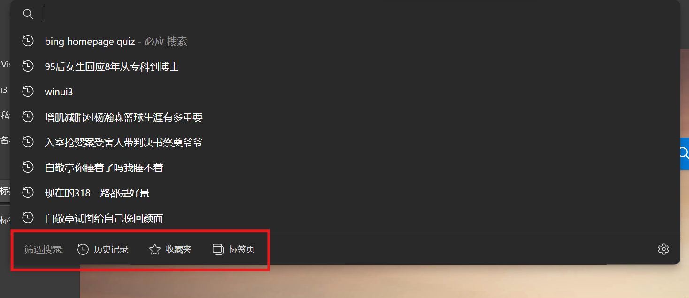
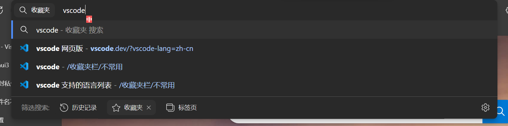

> [!TIP]
>
> 写作本文时，作者使用的 Edge 大版本是 140.0。理论上只要您的版本高于我的版本，以下内容就都是可用的。

最近在 Edge 地址栏搜索时，发现下面新增了一些筛选选项，如图。

我觉得该功能是非常不错的，但是每次去点击这三个按钮多少有点不方便。按照程序员的思维，这种情况下，要么会有一个快捷键，要么会有一个前缀。

可能是出于一种默契，我鬼使神差地在前面打上了 `*`，准备测试一下，竟然真的触发了收藏夹筛选。

接下来，我测试了各种符号，发现了各种触发方式。这些方式在我写作本文时，我没有发现有任何人曾经写过文章介绍或提到过，就算是 Edge 的官方文档，也并未涉及此内容。

我将我发现的各种方式总结如下：

- `*` 触发收藏夹搜索，非常有用
- `%` 触发标签页搜索，用处不大
- `^` 触发历史记录搜索，很有用
- `?` 调用搜索引擎搜索，而非默认的网址匹配 + 搜索，作用不大，因为搜索的内容通常是中文，而此前缀需要英文问号

值得注意的是，各个搜索都是英文匹配以及网址匹配，没有智能拼音匹配逻辑。所以，记忆网页的网址片段，而非收藏的名字通常是更优的选择。
