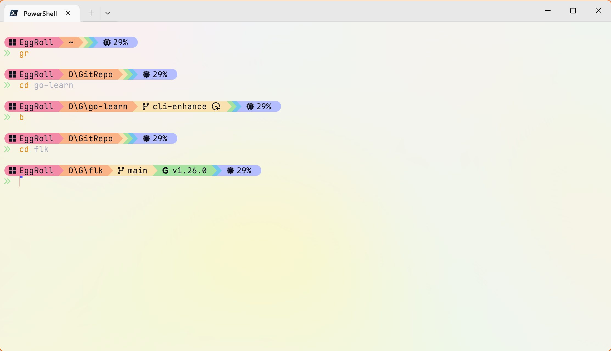

## 引言

Starship 是一个跨平台的命令行提示符，旨在提供快速、简洁和美观的终端体验。通过高度可定制的配置，用户可以根据自己的喜好和工作流程来调整提示符的外观和行为。

## 配置

Starship 的默认配置文件位于 `~/.config/starship.toml`。以下是一个示例配置文件，使用了 Catppuccin Mocha 调色板，并包含了各种模块的配置。此配置是我将预设配置深度修改后版本。

[下载我的配置文件](starship.toml)

使用该配置的效果如下：

