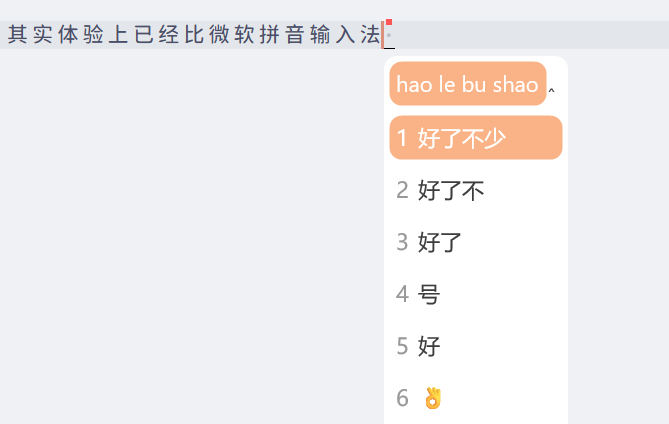

## 引言

最近被微软拼音输入法整得很恼火，如果打一个长词，而只选中了部分，后面的候选框有概率直接消失，只有再变动一个字母才可以恢复（删除一个或者再多打一个），这也让我有了把输入法换掉的想法。

Rime 输入法我早有耳闻，这一次就来试试 Rime 输入法。

## 探索

一开始，我选择了 Rime 方案中最近大火的一个——万象拼音，但是经过我的实际体验，并没有感受到有一种“跨时代的意义”，这和我心目中的“智能”还相差很远。

而且，在输入法中引入一个本地 AI 模型，会大大增加输入法的资源占用，在老设备上可以感受到明显的卡顿。于是，我决定放弃万象输入方案，转而使用更加成熟、稳健的雾凇拼音。

雾凇就是典型的以词库为基础的输入法，体验上只能说和微软拼音输入法相差无几，但是受益于 Rime 强大的自定义能力，其实体验上已经比微软拼音输入法好了不少。

在微软拼音输入法上，是难以实现拼音先不上屏、候选竖排、高亮的，这些在 Rime 中也仅仅属于基础配置。

而且，我深刻意识到，其实一个输入法最宝贵的资源是自己的词库。大多数词库，都是被各大输入法加密过的，比如微软拼音输入法导出的 `.dat` 格式，就明显是一种二进制文件，而使用 Rime 方案，是可以导出明文词库的，这一点相当地好，用户对于自己的词库有了更高的可控性。

虽然市面上有一些词库转换工具，但是我觉得还是一步到位比较省心省力。而且，经过我的实际试用，转换出来的词语也未必完全符合自己的需求。

我的想法是这样的：我现在越来越不被束缚在单一的平台上，我后期很有可能积极地转向 macOS 以及各大 Linux 发行版，这个时候一个跨平台的、统一的输入体验是相当必要的。Rime 本身是跨平台的，再加上其明文词库，我认为这会大大削减我切换平台的阻力。我现在逼着自己使用 Rime 作为输入方案，其实并不是因为这个东西有多么的好用，也不是因为自己想成为特立独行的极客，其实我的想法很简单，就是在培养一份自己的数据集，培养“可控的”输入习惯，以降低自己在收集数据和平台迁移上的成本。

而且，随着不断地使用，自己的词库一旦被养成，就基本没有了什么和平台强捆绑的理由，这是因为拿到了明文的词库，将获得大量的可操作空间，不用再畏畏缩缩束手束脚。

## 痛点

当前的拼音输入法还有一个最大的痛点，那就是根本无法实现根据上下文的自由输入，这让我十分地难受。有时候输入的速度快到一定的程度，就会导致上屏一些还没有反应过来的词语，但是其实这些词语并不是自己想要的词语，这就会导致错别字的问题。而且，有这样的缺点，就必定导致输入的时候只能几个词几个词地打，而不能做到一次性输入一句正确的话。因为假如要一次性输入一句话，中途因为选词导致的打断似乎是必然发生的。
