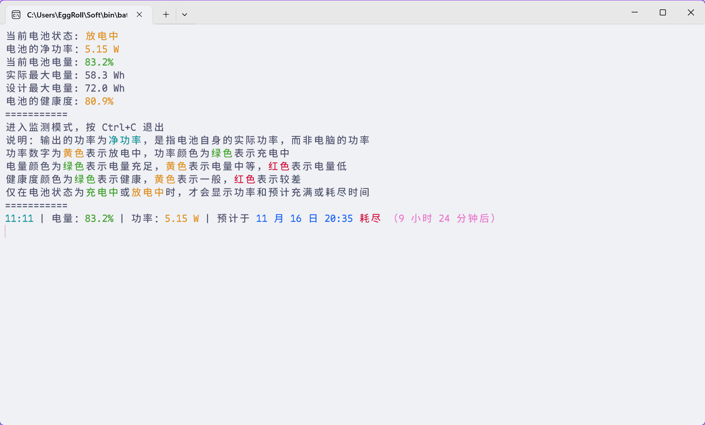

已完成 PowerShell 开发以及 Go 语言的迁移，待打磨。

效果如图所示：

一开始这是一个为监测 GalaxyBook2 充电行为的脚本（见 [GalaxyBook2 充电的诡异行为](https://eggroll.pages.dev/p/galaxybook2-充电的诡异行为/)），但是日渐完善后，有了在其他设备上使用的想法。毕竟脚本没有独立二进制可执行文件容易分发，就渐渐用 Go 语言重构了。
