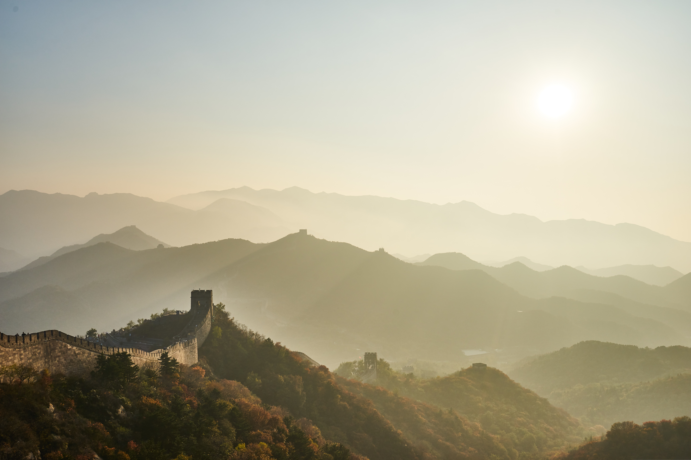
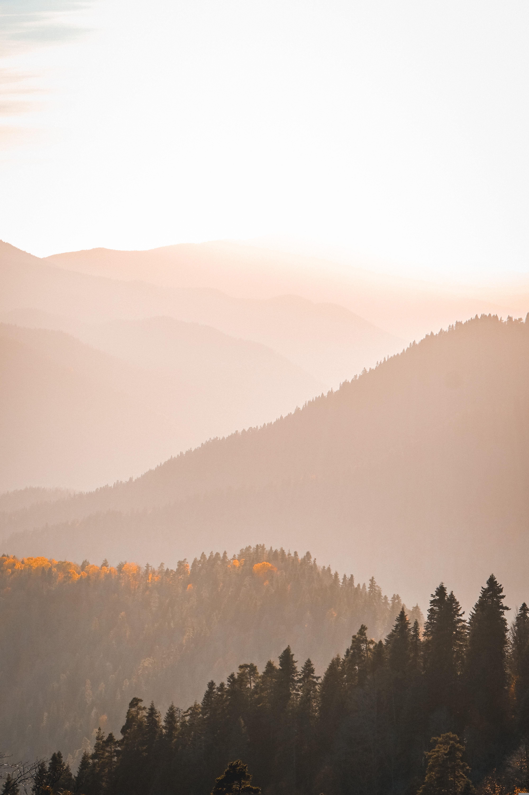

## 说明

目前，在我的博客中，文艺类和风景类图片的主要来源是：<https://pixabay.com/>。

网站的说明为：

> Pixabay is a vibrant community of creatives, sharing royalty-free images, videos, audio and other media. All content is released by Pixabay under the Content License, which makes it safe to use without asking for permission or giving credit to the artist - even for certain commercial purposes.

译文如下：Pixabay 是一个充满活力的创意社区，分享免版权图片、视频、音频和其他媒体资源。所有内容都由 Pixabay 依据内容许可发布，这使得在使用时无需征求许可或给艺术家署名——即便是用于某些商业目的。

## 图片测试

本网站不仅支持常规的图片加载，也支持相册语法，多张图片的排布是自动的。

 

## 关于性能优化

加载高清原图对网速的要求属实过高，在今后，我使用的图片大多会经过酌情压缩。压缩的程度是：以屏幕大小 1920 * 1080 为基准，根据该图片能在页面上占据的最大空间决定该图片的分辨率，以最大幅度优化网页加载速度。

## 其他说明

有一些图片，有时其作者难以找到，或是无从查找是否有明确的版权说明。为了增加文章的美观度，我可能采用此类图片。更加详细的说明参照此处：[本博客的版权声明](https://eggroll.pages.dev/%E5%85%B3%E4%BA%8E/#%E7%89%88%E6%9D%83%E5%A3%B0%E6%98%8E)。
