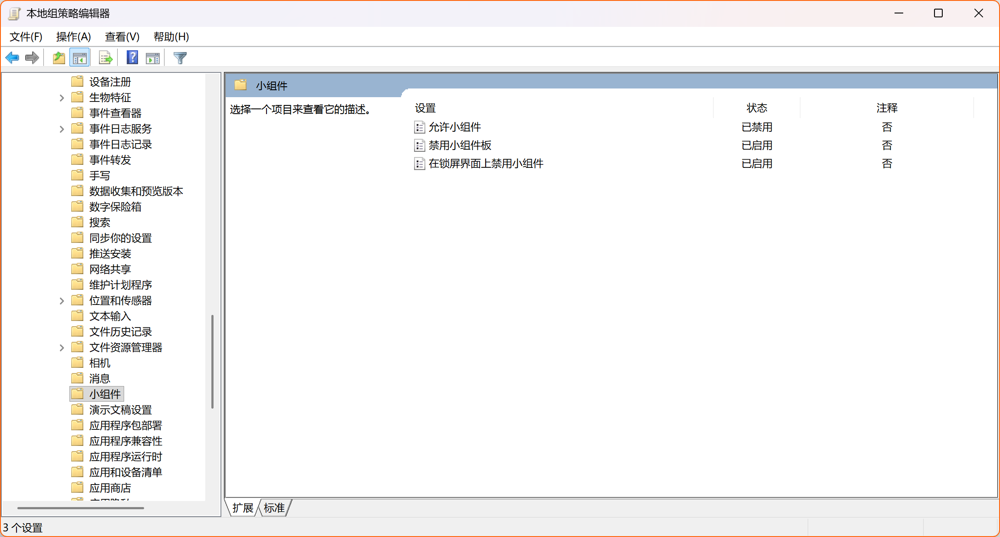

## 引言

随着 Windows 一步一步升级，引入了越来越多影响用户的功能。举例来说，像牛皮癣一样的强制自动升级、更新大量文件时偷偷在后台运行的索引、应用商店的自动更新，都非常恼人。

随着我的不断探索，我发现这其中大量的功能其实都可以用一些奇技淫巧来禁用，我用起来效果都很好，请读者自行判断。

## 禁止自动更新

Windows 的自动更新可以说是一大痛点，但是事实上，几乎所有的自动更新都可以用组策略的方式禁止。

### 禁止 Windows 自动更新

请读者注意，这是一种极其安全、合理的方法，我们所做的事，不是不更新，而是缓更、慢更、有次序地更（）。

这和网络上大多数“彻底干掉” Windows 的方法不同，采用组策略，可以讲更新调整为“只允许手动更新”。用户可以正常地收到更新，但是绝不会自动下载和安装。

### 禁止微软商店的软件自动更新

### 禁用烦人的小组件

这将彻底禁用小组件，小组件将再也不会自启动（该软件每天请求 GPS 高达数十次），无法通过快捷键或手势呼出，无法通过状态栏手动开启，也永远不会出现在锁屏上。

## 导入组策略的其他方法

事实上，组策略不是一个多么神秘的东西。在本地，组策略是文件的形式存储的。所以，批量导入组策略也非常容易。
