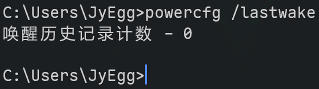
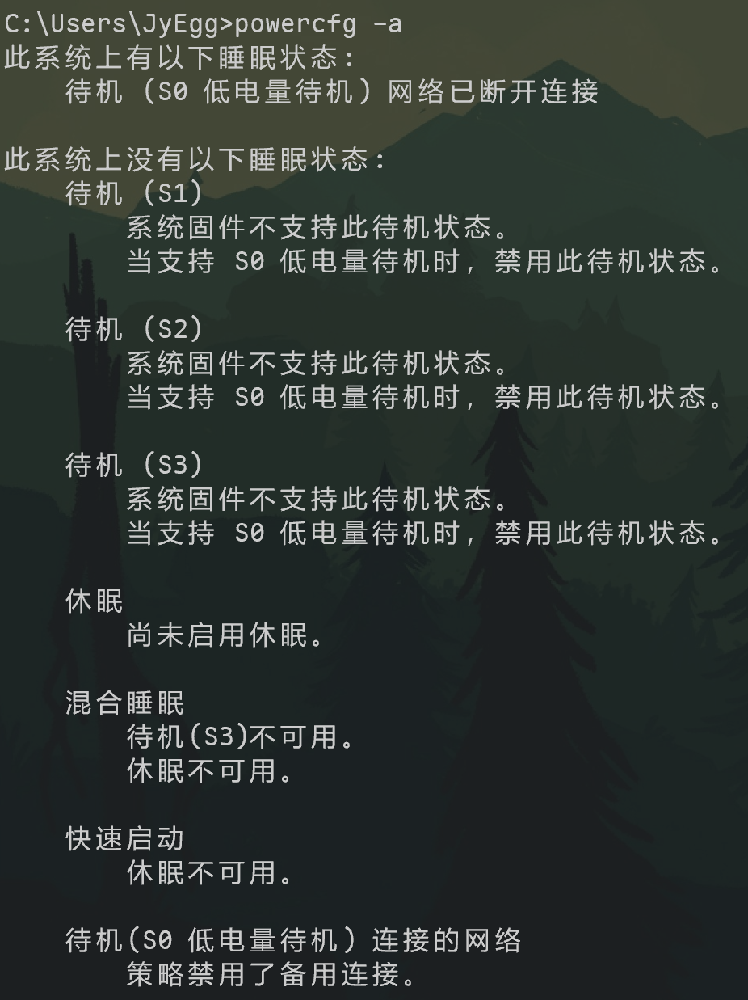

## 引言

我的电脑是 2023 年购入的轻薄本，完全弃用了传统的 S3 待机模式（写入到内存），而采用了 S0 现代待机。该模式并不好用，导致了许多 bug，包括但不限于蓝牙连接问题。我对其颇有微词。

最大的问题是，用户通过特殊的方法恢复到 S3 模式会引起更大的问题，比如一旦进入睡眠就再也无法唤醒。毫无疑问，这封死了用户的选择。

写这篇文章，源于我的电脑在睡眠模式下，又毫无征兆地自启动了。遗憾的是，由于采用了 S0，许多经典的命令，比如查找唤醒原因，用起来是没有效果的。如果电脑是 S3 模式，那么在 CMD 或者 PowerShell 下执行 `powercfg /lastwake`，效果是读取电脑上一次被唤醒的原因。而在 S0 电脑上，效果如图：



输入 `powercfg -a`，可以显示电脑启用的各种睡眠、休眠类型：



在通常情况下，S0 状态下网络是连接的，也会具有“快速启动”状态，我取消了这两个功能。

之所以要取消网络连接功能，是因为我怀疑睡眠的自动唤醒和网络有关。可是，经过我数个月的测试，发现恐怕关系不大。

## 现代待机的特点以及针对性的解决

如果在接入电源的情况下进入了睡眠，直接拔掉电源，在此情况下进入现代待机，会导致异常耗电，不亚于日常使用。

推荐的做法是：拔下电源后，进入系统再手动进入睡眠状态，会缓解此问题。

## 禁用休眠

我不喜欢休眠模式，休眠模式会大量写入硬盘，影响硬盘寿命。

管理员运行 PowerShell，执行

```powershell
powercfg /h off
```

即可禁用休眠。此命令会顺带禁用快速启动（快速启动是依赖于休眠功能特性的）。在我看来，这同样是一个垃圾功能。

## 禁用快速启动

如果要单独禁用快速启动，就去控制面板，此处不再赘述。

## 取消网络连接

若您的系统版本在 Windows 10 2004 之前，还可以采用此方法，否则已经没有必要再尝试。

> Deprecated starting in Windows 10, version 2004.

进入注册表编辑器，目录为

```text
HKEY_LOCAL_MACHINE\SYSTEM\CurrentControlSet\Control\Power\PowerSettings\F15576E8-98B7-4186-B944-EAFA664402D9
```

将其属性改为 2。

- 参见微软官方文档：<https://learn.microsoft.com/en-us/windows-hardware/customize/power-settings/no-subgroup-settings-allow-networking-during-standby>


此后进入高级电源设置，将网络连接全部改为禁用即可。


自 Windows 10 2004 后，现代待机默认永恒保持网络连接，且不再支持任何手动调整与更改的行为。强烈谴责这种一刀切的行为！

- <https://learn.microsoft.com/en-us/windows-hardware/design/device-experiences/modern-standby-network-connectivity>
