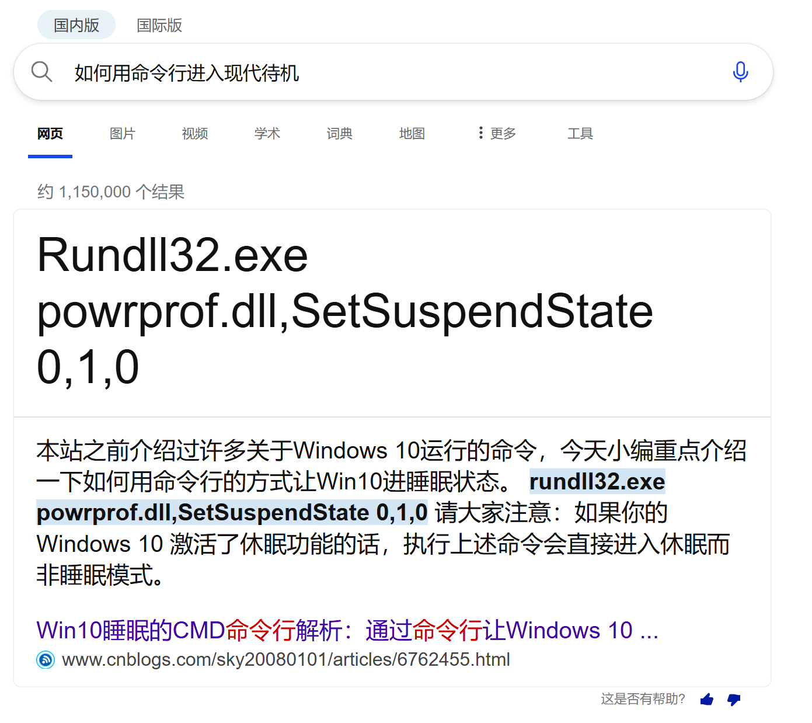
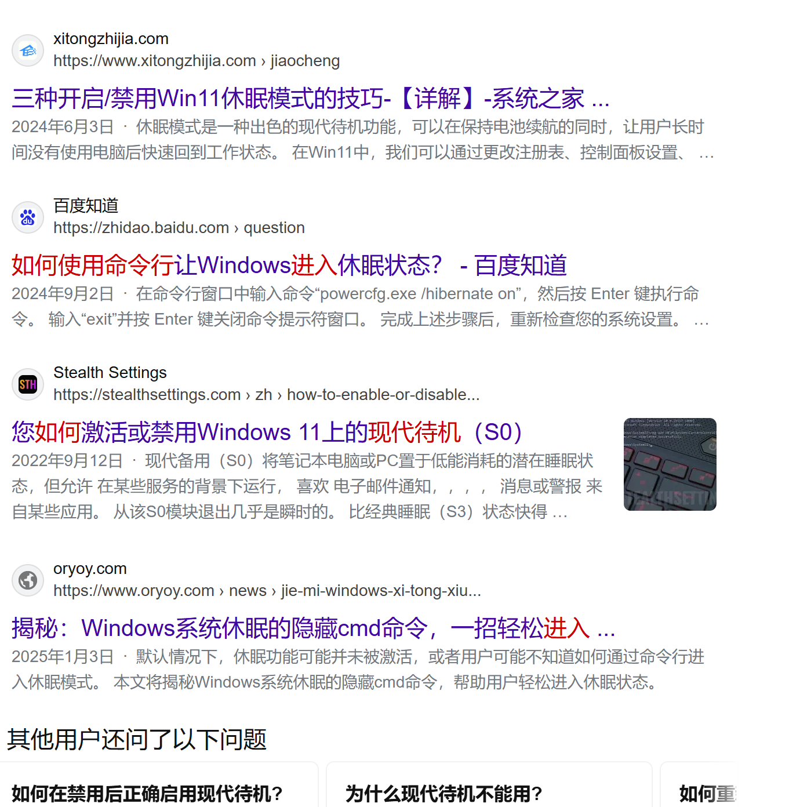

## 搜索引擎的现状

在搜索引擎上查找技术资料，内容农场真的是越来越严重了，最严重的是百度，其次是必应。至于谷歌，在中文搜索上已经近乎被这一类内容农场彻底污染了，处于完全不可用的状态。更严重的是，AI 生成的文章越来越多，已经到了令人发指的地步。最令人恶心的是，对这一类文章追根溯源，竟然是另一篇 AI 生成的文章。这种情况在 CSDN 上尤为常见。对于技术类文章，建议在查找之初就完全排除 CSDN 的搜索结果，以免被文章误导。

我以一个问题为例，说明我的看法。

“本站”“小编”，这是内容农场中惯用的说法。倘若这篇文章对我解决问题有帮助，那我也不必说什么。事实是，这篇文章和现代待机毫不相关，就算复现文章中的条件（比如“禁用休眠功能”）也对解决问题没有任何帮助。

更可怕的是，我为大家展示之后的结果：

我可以用亲身经历告诉大家，全部无用。结果中出现了“oryoy.com”，这是我在查阅了诸多技术文章后，最恶心、最令我生厌的内容农场。可现实情况是，不管查找什么内容，总有它的一席之地，这就是搜索引擎的悲哀。

对于现代待机的问题，我在探索很久后，自行制作了一款开源工具来解决。如果您遇到了同样的问题，请点击我博客里面的 GitHub 图标，访问到我的主页，“quick-modern-standby”就是您的答案。

### 如何解决此问题

目前，我想到的比较好的几种方法是：

1. 使用搜索引擎语法，例如在关键词后打上 `-csdn` 就可以过滤掉大量的 CSDN 结果
2. 使用相关屏蔽内容农场的浏览器插件（见[内容农场屏蔽列表](https://eggroll.pages.dev/p/内容农场屏蔽列表/)）
3. 使用 AI 作为搜索工具，但明令要求其给出来源，再根据总结去学习最原本的文章，该方法或许并不靠谱，但是与其在垃圾堆里淘金，不如先精选一波垃圾堆（

## 对 CSDN 的批判

CSDN 上现在充斥着大量复制粘贴、AI 洗稿现象，在我看来，得到的内容已经彻底失去了查阅的价值。该平台最使人心寒的并非这一点。阅读，需要关注；复制，需要登录；下载，需要付费……每看一篇文章，我就越失望。

尤其可恶的是，CSDN 未经作者允许，擅自将文章设为“关注可阅读”、附件“付费可下载”，此事引起了一些作者的不满。与其相伴相生的，是 GitCode 这一平台。根据我的查阅结果，GitCode 的仓库大量搬运自 GitHub，几乎所有的仓库都用 AI 重新生成了 README，没有给出任何原作者信息，导致难以溯源。还有一点让人非常不满：GitCode 擅自将搬运的仓库改为了 MIT 协议，这无疑是对原作者的极大不尊重。

## 对知乎的批判

知乎上现在存在大量的带货软文，查找内容时，经常出现文不对题的现象，再仔细往下一读，对于各种产品的比对和介绍占用了超过 80% 的篇幅。这样的文章，现在充斥在知乎的各种问题下，严重拉低了回答的平均水平。

## 对哔哩哔哩的批判

铺天盖地的广告、商单视频。平台上的东西到底还有多少是可信的？我看了我这几年的年度视频占比市场，搞笑竟然占了 80%。也好，就纯当作用来娱乐的平台吧。

## 本博客的目标

我在此立下誓言，本博客将保持产出优质内容的初心，始终以解决真实问题、抒发真实感想为目的。

更重要的是，我将完全杜绝使用 AI 撰写文章，互联网上的 AI 文章已经让我深恶痛绝了，我绝不会写出自己讨厌的文章。就算我的文笔再烂，我也会保证，所有的文章、每一个字都是我自己敲上来的，都是我自己的成果。

每当开学时，更新维护博客的时间就会变少，但是我会尽可能保持更新。对于旧文章的维护也同样重要，我甚至会在维护上投入更多的时间。
