## 引言

本文将长期更新，逐步加入我对系统重装的理解，让大家体会如何从一个“热爱探索新技术的强迫症”的角度去看待重装系统这件事。

目前网络上有诸多陈旧的重装系统教程，比如 Ghost 技术，而鲜有使用全新技术又十分完善的系统重装教程。就算存在，也大多处于一种技术科普的角度，读者跟着操作，可能确实可以完成重装的全步骤，但是对于其中可能遇到的问题，仍然云里雾里，还需要查阅大量的资料。

为什么不应该再采用旧方式？现在几乎所有的电脑都已经是用了 UEFI 技术，旧技术对此毫无兼容性，这是原因之一。

最重要的原因是，通用的重装系统方式往往采用所谓的“万能驱动”。

事实上，一台电脑会出现的各种问题大多是由于驱动问题导致的，举例来说，无故的花屏、闪屏，显卡驱动出现问题的概率要远远大于操作系统出现问题的概率。

如果盲目采用“万能驱动”，这些驱动并不适合自己的电脑，日后出现问题的可能性也大大提高。

此外，厂商提供的驱动往往是最适合电脑、经过了特定优化的版本，这些版本的驱动是最安全、最稳定的。

读到这里，读者可能会问，那这和我安装一个原版系统，再手动安装厂商提供的全套驱动有什么区别呢？

答曰：节省大量的时间，一次提取，之后几乎可以做到再也不需要维护。

综合以上来说，其实所谓“现代化”系统重装教程，现代化在何处呢？就现代化在驱动的处理上。

本文操作方式完全参照个人习惯，做不到事无巨细，但会逐渐更新完善。这也是我重装系统多年以来经验的系统梳理。使用本教程重装，只适合个人的电脑，这也是较为常用的状态。

本文章的前半部分是综述性的，在最后一部分会同步我个人的重装习惯，供参考。最后的内容是在综述的基础上，以“实事求是”的原则，在特定设备上给出的参考流程。

## 准备工作

### 备份驱动

推荐采用 Dism++：<https://github.com/Chuyu-Team/Dism-Multi-language/releases>。最好在原本的系统内备份驱动，会得到更多友好的驱动名称而非乱码。当系统崩溃，不得不在 PE 中备份时，也是可以的，最终恢复起来效果应该一致。在系统内备份驱动可以剔除一些无关驱动，比如 VMware 安装的虚拟网卡。

以下是详细说明：

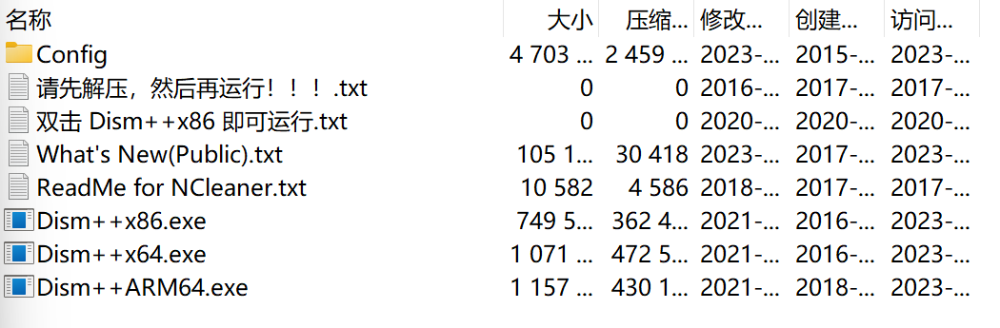

解压全部内容到一个文件夹下。

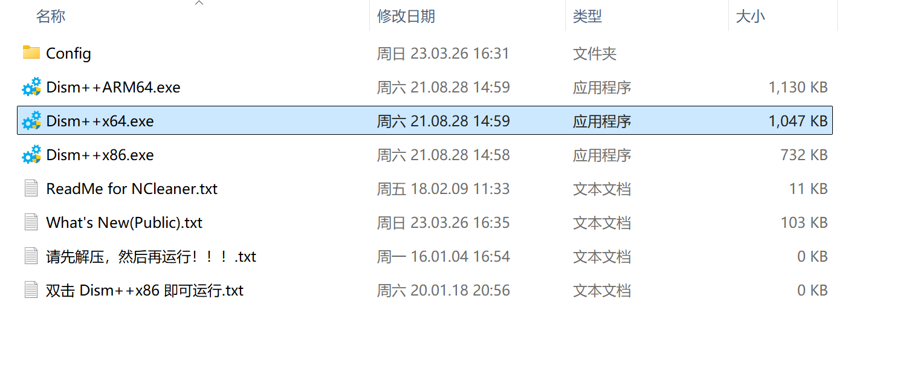

根据系统体系架构选择，我选择 x64。弹出“是否允许更改”的 UAC 窗口，请选择“是”。

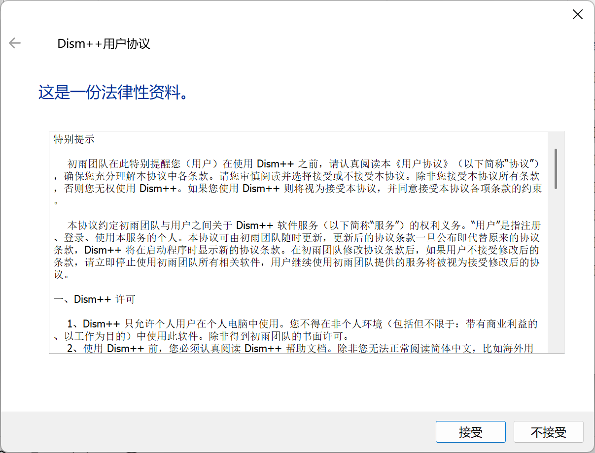

接受协议。

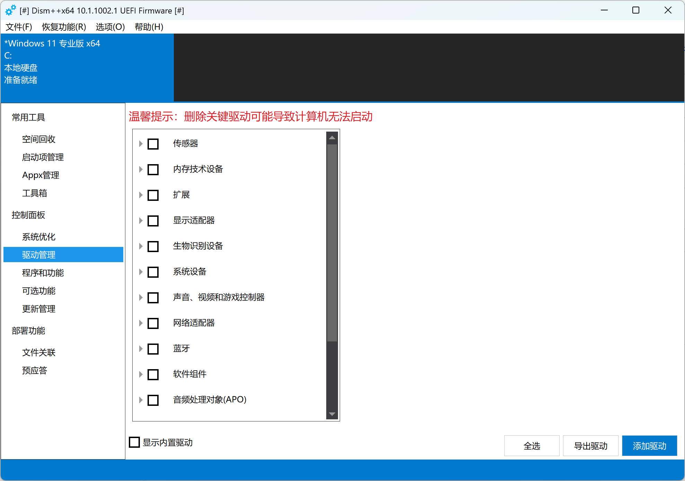

在首页如图位置打开驱动管理。

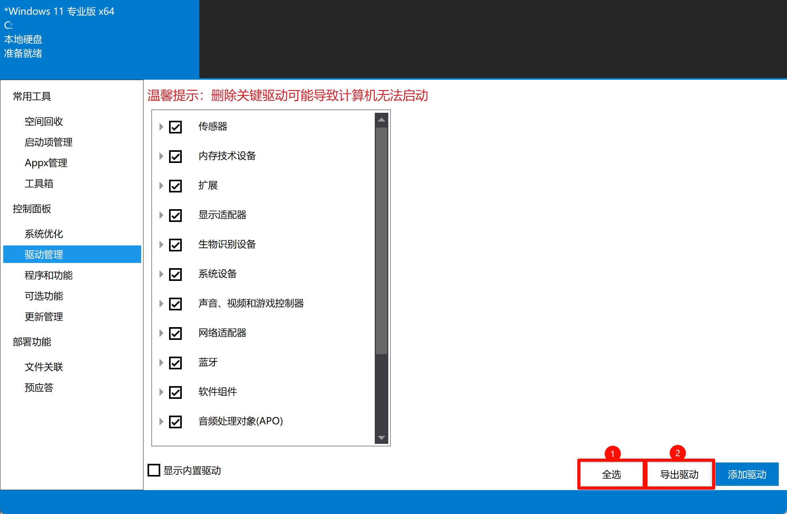

一般情况下，按照图示，选择某个文件夹导出即可完成备份。

然而，可能有一些由软件加载的驱动是我们不想要的，我总结了一些剔除原则：

1. 是否可以斩钉截铁地确认是“无用驱动”
2. 是否是“关键驱动”

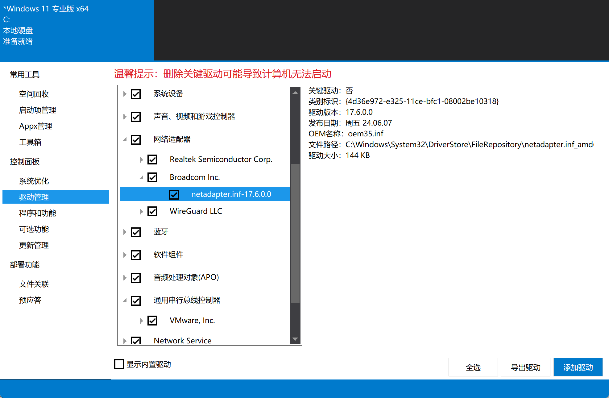

经查看，该驱动是博通公司的，类型为网络适配器，非关键驱动。如果可以确认自己的电脑网卡不是博通的，那么该驱动就有可能是 VMware 的驱动之一（VMware 已被博通收购），此时就可以取消勾选。

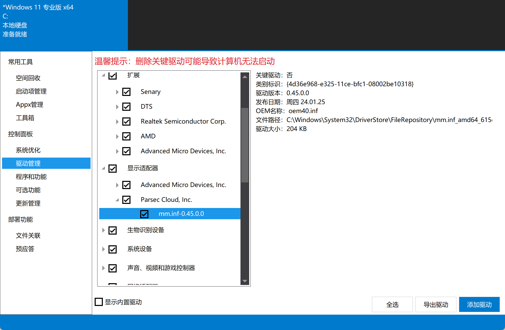

此驱动是我自己加载的虚拟显示器驱动，显然不应该保留。

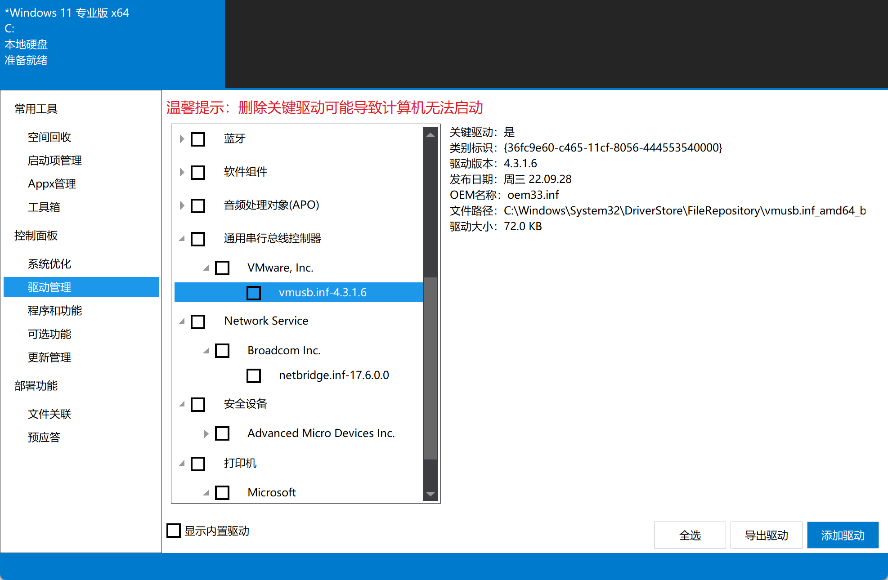

该驱动是 VMware 附属驱动，虽然是关键驱动，但是我可以保证之后不会用到或者需要重新安装 VMware，那么也需要移除。

> 值得注意的是，内置驱动通常不需要更改。在某些特殊情况下，建议备份内置驱动（比如安装 Windows on ARM），但是除非出现问题如无法开机，不要导入内置驱动。

### 下载系统镜像

下载系统镜像的方式多种多样，在如今，我已经完全不再推荐使用第三方修改过的系统。一个可供下载原版镜像的链接如下：<https://massgrave.dev/genuine-installation-media>

如果您希望使用更小的 ESD 格式，那么使用该网站：<https://worproject.com/esd>

下载时若弹出安全提示，请始终允许。上述两个网站的安全性是可以保障的。

> 下载结束后，务必校验，一旦镜像由于网络问题损坏，将产生无法预料的后果。

当前，个人不建议使用 esd 格式的镜像重装系统。根据我多次的使用经验，使用 esd 格式重装系统会带来一些意料之外的问题，比如声卡驱动不稳定等。可能是应为 esd 格式比较精简，确实了一些必要的内容。总体而言，建议采用 iso 镜像。

### 下载 Ventoy

Ventoy 是我个人很喜欢的一款轻量化工具，几乎可以启动任何 ISO 镜像，这包括 Windows ISO、其他系统的 ISO，甚至是 PE 的 ISO。这一点大大简化了装系统工具的制作，也不再影响该 U 盘的日常使用，可谓终结了每做一次就要格式化一次 U 盘的时代。其下载链接如下：<https://www.ventoy.net/cn/download.html>

如果您的电脑开启了安全启动，请参照这篇文章：<https://www.ventoy.net/cn/doc_secure.html>

#### Ventoy 的使用

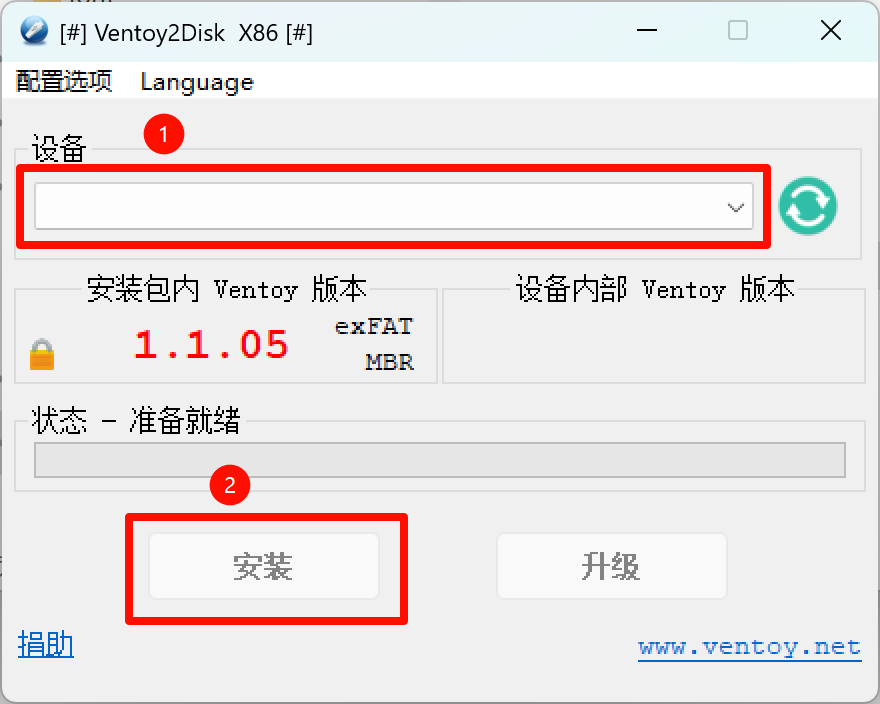

1. 制作 Ventoy 盘
2. 放入镜像（PE ISO、系统 ISO、ESD 等）
3. 放入备份的驱动包

## 系统安装

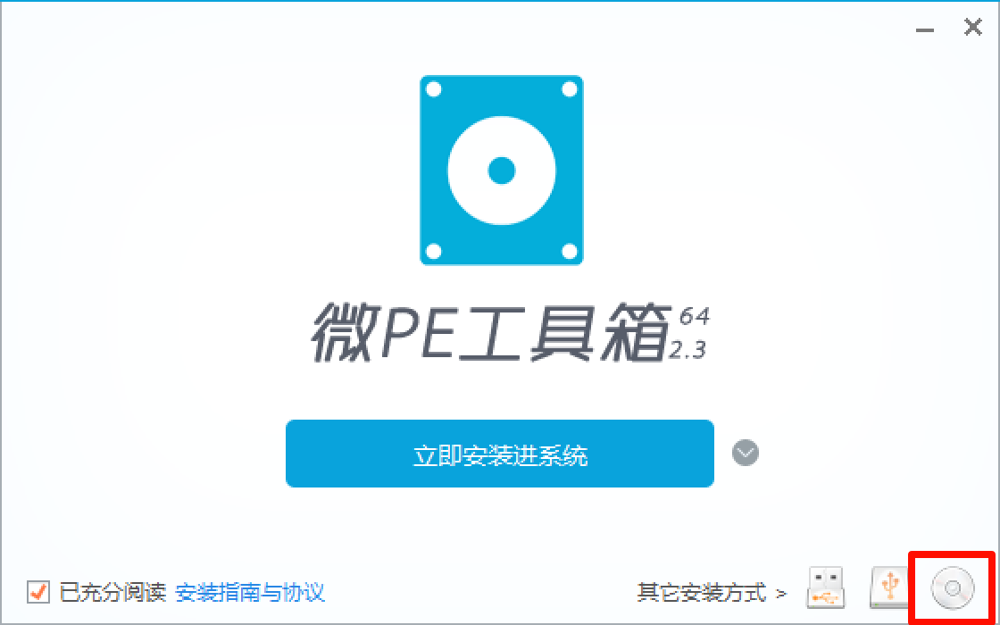

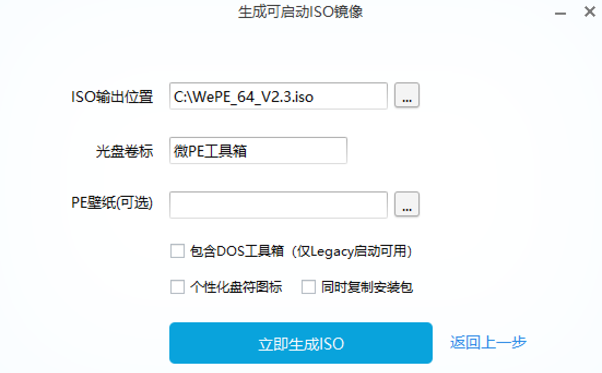

1. 推荐：下载其他 PE ISO 镜像，再使用 PE 完成系统安装，推荐`微 PE`
2. 直接调用微软原版镜像完成安装（不推荐，若采用此方法，后文驱动注入步骤将在一定程度上失去意义）

在 PE 中，使用 CGI 或 Windows NT 安装器安装镜像即可。

### 驱动注入

在 PE 中用 Dism++ 向刚安装好系统的分区注入驱动。

完成此步后即可拔下 U 盘。事实上，由于 PE 通常只是写入内存，如果您的镜像、驱动在其他硬盘分区，进入 PE 后，U 盘就已经是非必要的了。

### 重启

重启系统并等待驱动完成加载。

## 激活 Windows

管理员启动`终端`或者`PowerShell`，输入

```powershell
irm https://get.activated.win | iex
```

## Windows 11 重装的标准流程【个人自用】

### 重装前

获取 ISO 镜像，以获得较稳定的版本和虚拟机复用能力。虽然 ESD 有更小的体积，但是可能会对日后的虚拟化用途增加不必要的步骤。

每次获取镜像后留档，对比哈希【这是绝对必要的，如果镜像出现损坏，又没有合适的后备镜像，重装中断时将追悔莫及】，建议使用比当前大版本靠前一个版本的稳定版系统，每次重装前需要查看当前的问题说明，以决定是否要升级到最新版本。当前的 24H2 和 25H2 都不怎么稳定，23H2 已经进入了稳定且好用的时期。由于 25H2 只是 24H2 的“功能启用包”，二者在 Bug 上几乎没有任何区别。鉴于微软不断地给这些版本引入毫不必要的 AI 特性，现在选择 23H2 似乎才是明智的选择。

## 重装中

- 格式化 ESP 分区
- 释放映像
- 导入驱动
- 重启

## 重装后

在联网界面：

<kbd>Shift</kbd> + <kbd>F10</kbd> >> 点击弹出的窗口 >> `start ms-cxh:localonly` 可以直接建立无密码本地用户

---

所有步骤密切关注任务管理器的网络变化。

- 恢复到默认主题
- 关闭 Defender 中的实时保护和篡改防护
- 使用注册表编辑，彻底关闭 Defender 和 Smart App Control【需要重新启动才可以看到效果】
- 禁止安全中心软件的自启动
- 配置组策略【值得注意的是，导入的组策略在刷新时间上完全随机，几乎不可用，只能手动设置，这样可以立即生效】
  - Windows 更新
    - 管理从 Windows 更新提供的更新
      - Windows 更新不包括驱动程序：已启用
    - 管理最终用户体验
      - 配置自动更新：已启用：2 级
  - 应用商店
    - 关闭自动下载和安装更新：已启用
  - 小组件
    - 允许小组件：已禁用【此处应该先在设置中关闭小组件，这可以防止小组件的部分仍然持续占位，影响到 Traffic Monitor】
    - 禁用小组件板：已启用
    - 在锁屏界面上禁用小组件：已启用
- 查看 Edge 的版本号，酌情关闭 Edge 的自动升级，如果版本合适，可以在此处直接禁用 Edge 的所有更新任务计划和更新服务
  - 141 是一个很稳定的版本，这个版本的 Edge 内置在 23H2 的 2025 年十月更新中，安装这个版本的系统时，在联网前就要关闭 Edge 的任务计划和更新服务
- 开启网络并静置数分钟
- 启用管理员 PowerShell 或终端，执行以下操作
- 用命令禁用 Windows 的索引服务并且关闭其自启动
  - 【Stop-Service wsearch】
  - 【Set-Service -Name wsearch -StartupType Disabled】
- 关闭休眠【sudo powercfg /h off】
- 重命名设备
- 重启【当已经长期持续没有后台高性能活动时】

---

- 登录微软账户并静置数分钟【重启后再进行登录操作，几乎可以把网络错误的概率降到 0，假如在安装好系统后第一次开机就尝试登录微软账户，大概率会出现无法连接的问题】
- 调整文件管理器的设置
- 安装 7-Zip
- 将 v2rayN 解压并以管理员启动
- 打开任务管理器，在网络空闲时，以 Tun 模式以接管全部网络【这是能正常打开微软商店的条件，这时不建议同时开启 Tun 和系统代理，虽然在日常场景下这并没有问题，但是这会导致微软商店陷入环回，从而无法连接】
- 更新 Terminal
- 安装 pwsh 和 starship【可能需要更新软件包组件，这样才可以运行 winget】
- 将电源按钮的功能设为关机，这在系统近乎卡死的时候还有机会正常关机，不至于每次都强制关机

---

### 瑞昱网卡（蓝牙）的相关问题和解决方案

- 右键托盘中的蓝牙图标，开启允许发现，有助于减少蓝牙的断连问题（RedmiBookPro）
- 设备管理器中关闭蓝牙的省电模式

### AMD 显卡驱动相关问题和解决方案

- 直接更新对应的型号，不使用自动检测的软件，建议使用和当前系统更新日期相近的一个版本【盲目追求最新的驱动版本是绝对错误的，通常最新的驱动适配最新的版本，由于我们安装的并不是最新的系统，在这样的情况下使用最新版本的驱动，会遇到不少问题。比如在 23H2 上使用 780M 的 2026-01 最新驱动,会导致整个 Software 性能奇慢并吃满两个核心，近乎陷入了死循环】
- 当没有遇到任何显示问题时，比如奇怪的阴影闪烁，完全可以不更新显卡驱动，不过为了追求稍高的性能，审慎地更新驱动程序是值得的
- 显卡驱动更新之前，务必查看显卡官方给出的已知问题信息，确定可以更新时再更新【务必不要使用最新的驱动版本，除非修复了无比重要的问题】
- 目前，23H2 的十月更新配合 RedmiBookPro 的默认显卡驱动没有任何问题，非常稳定，而 24H2 和 25H2 在更新显卡驱动后依然存在一些小问题
- 目前，UM780XTX 在使用 23H2 系统的情况下，千万不能更新最新版本的驱动，这会导致 Software 陷入近乎卡死的状态，以及出现无法调节屏幕亮度的问题，这非常严重
- `whql-amd-software-adrenalin-edition-25.9.1-win10-win11-sep-rdna.exe` 是一个尚可的版本

### Edge 相关问题和解决方案

- 不喜欢在窗口管理界面的标签页：系统 >> 多任务处理 >> Alt + Tab 不显示选项卡
- 切换虚拟桌面的右上角窗口阴影问题：关闭一个实验性功能 #edge-window-tab-manager【似乎目前该问题仅出现在 Windows 11 23H2】

## 附录：常用软件部署

以下是我常用的一些软件。

### Office

部署 Office 建议采用 Office Tool Plus，可以精确地控制需要部署的版本。

假如部署成功后，需要激活 Office，请以管理员启动`终端`或者`PowerShell`，输入：

```powershell
irm https://get.activated.win | iex
```

### MyKeymap

一款键盘增强软件。

<https://xianyukang.com/MyKeymap.html>

### PixPin

<https://pixpin.cn/>

### Listary

<https://www.listary.com/>

### InputTip

<https://inputtip.abgox.com/>

### TrafficMonitor

<https://github.com/zhongyang219/TrafficMonitor/releases/>
