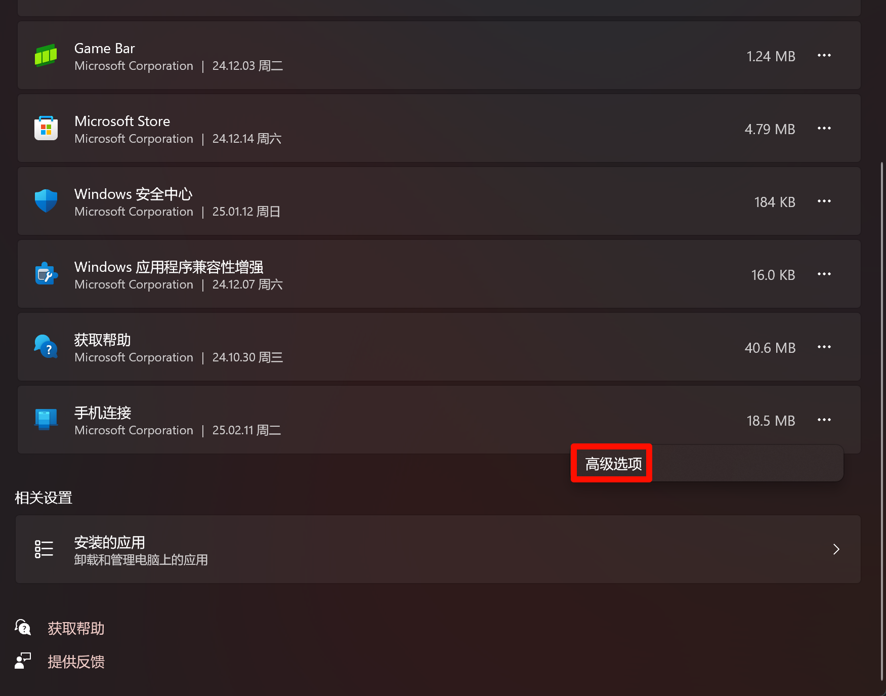
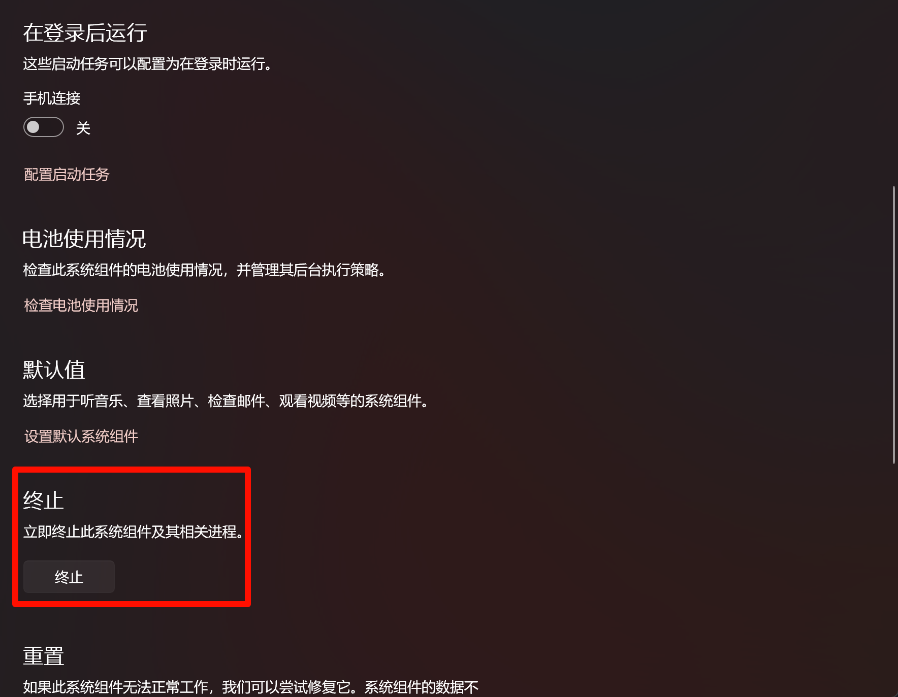

微软的`手机连接`软件在禁用了明面上能找的所有自启动选项后，仍然屡次自启动，单单一晚上就让我手动关闭三次之多。

我实在忍无可忍了，开始寻找一下解决方法。

## 解决方案（已确认没用，仅供尝试）

- 搜索`系统组件`，进入系统组件设置
    
- 点击`手机连接`右边的三个点，进入高级选项
    
- 设为`从不`
    
- 手动终止软件
    

## 感想

就在我写这篇文章的一段时间里，在完全禁止了手机连接后台运行的情况下，手机连接再一次顽强地自启动成功了，点赞🤡
