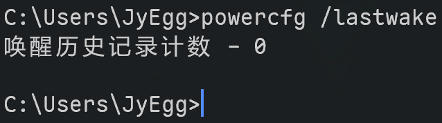
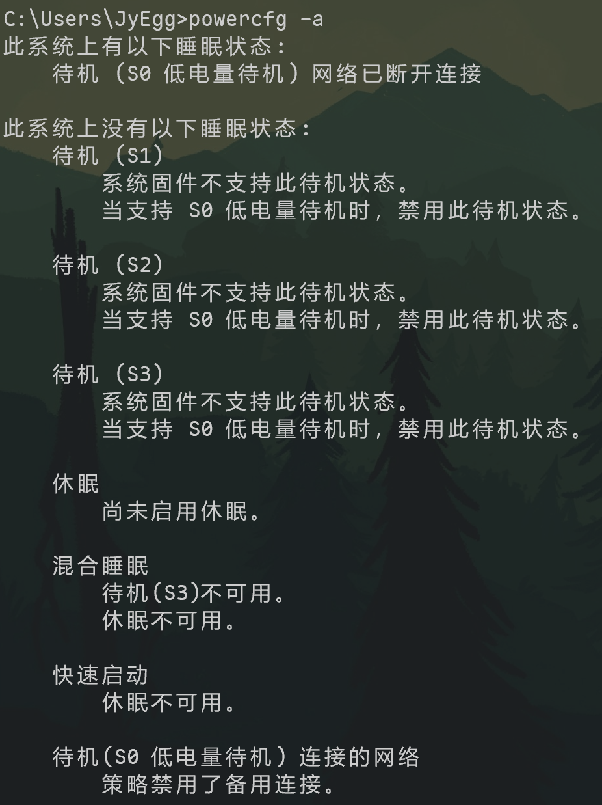
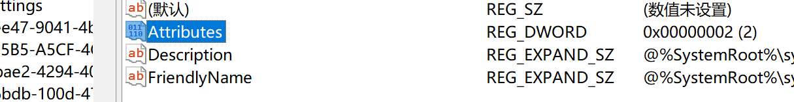

## 2025-02-25 更新

在禁用网络连接后，电脑再一次从睡眠中自动唤醒，原因仍未知。

## 引言

我的电脑是 2023 年购入的轻薄本，完全弃用了传统的 S3 待机模式（写入到内存），而采用了 S0 现代待机。该模式并不好用，导致了许多 bug，包括但不限于蓝牙连接问题。我对其颇有微词。

写这篇文章，源于我的电脑在睡眠模式下，又毫无征兆地自启动了。遗憾的是，由于采用了 S0，许多经典的命令用起来是没有效果的。

举个例子，如果电脑是 S3，那么在 CMD 或者 PowerShell 下执行 `powercfg /lastwake`，效果是读取电脑上一次被唤醒的原因。而在 S0 电脑上，效果如图：



输入 `powercfg -a`，可以显示电脑启用的各种睡眠、休眠类型：



在通常情况下，S0 状态下网络是连接的，也会具有“快速启动”状态，我取消了这两个功能。如何取消快速启动，网络上教程比较多，而取消 S0 的网络连接，教程就比较稀缺了。

之所以要取消网络连接功能，是因为我怀疑睡眠的自动唤醒和网络有关，今天先作此尝试，通过实践判断还会不会出现无故唤醒的情况（注：电脑的唤醒定时器早已设为禁用，然而并没有效果）。

## 取消网络连接

进入注册表编辑器，目录为

```reg
HKEY_LOCAL_MACHINE\SYSTEM\CurrentControlSet\Control\Power\PowerSettings\F15576E8-98B7-4186-B944-EAFA664402D9
```

将其属性改为 2。



此后进入高级电源设置，将网络连接全部改为禁用即可。


## 补充

本文章参考自 <https://www.sulabs.net/?p=1109>，但没有采用文章的方法。

直接进入注册表改属性的方法参考自 <https://www.zhihu.com/question/554361321>，该文章说明了阻止电脑由睡眠状态进入休眠状态的方法（如果电脑已经开启了休眠）。

同理，读者如果发现有一些在其他教程中提到，但自己电脑上并没有的电源设置，多半是因为微软隐藏了。读者大可以触类旁通，搜索注册表中那些字符串，然后根据属性开启。这也是为什么我没有直接采用第一篇博文写入注册表的方法。经历两次类似的情况，我意识到此问题可以是一个系列，欢迎读者参考。
